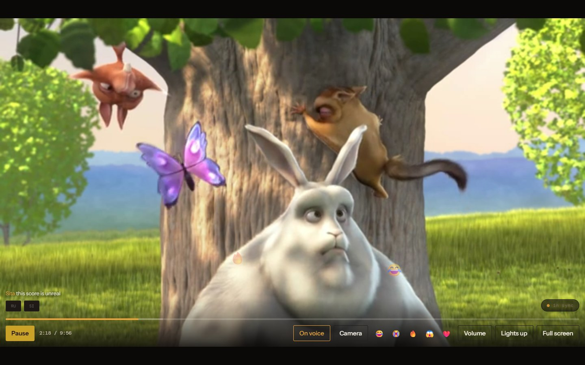
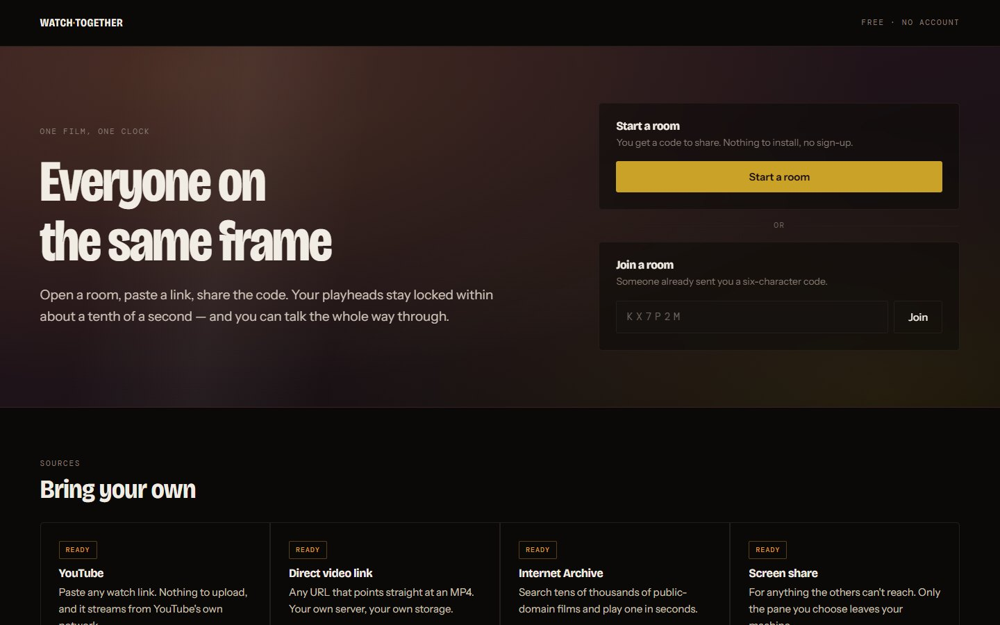
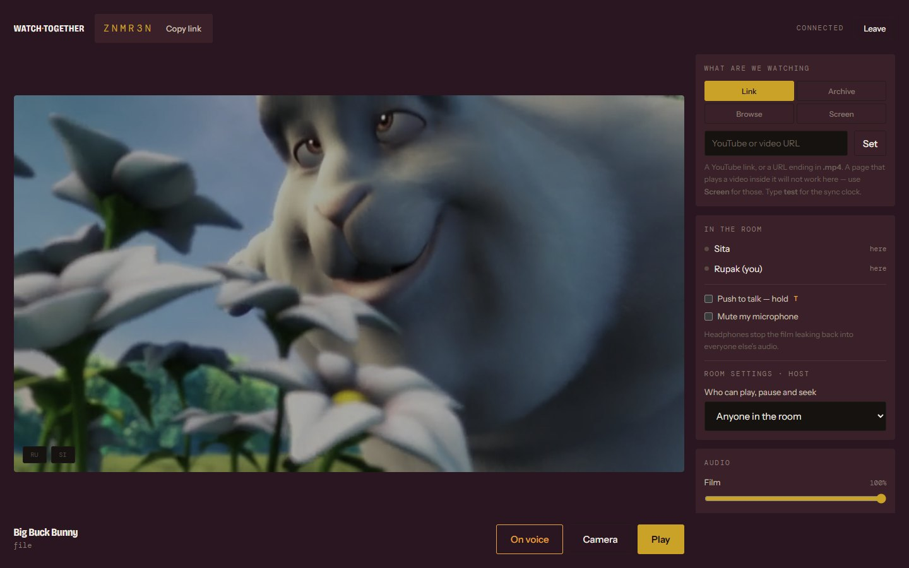
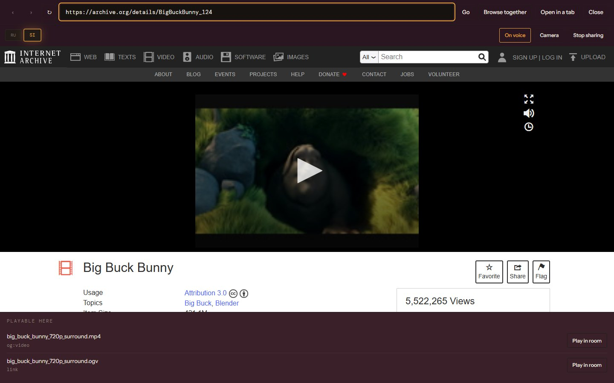
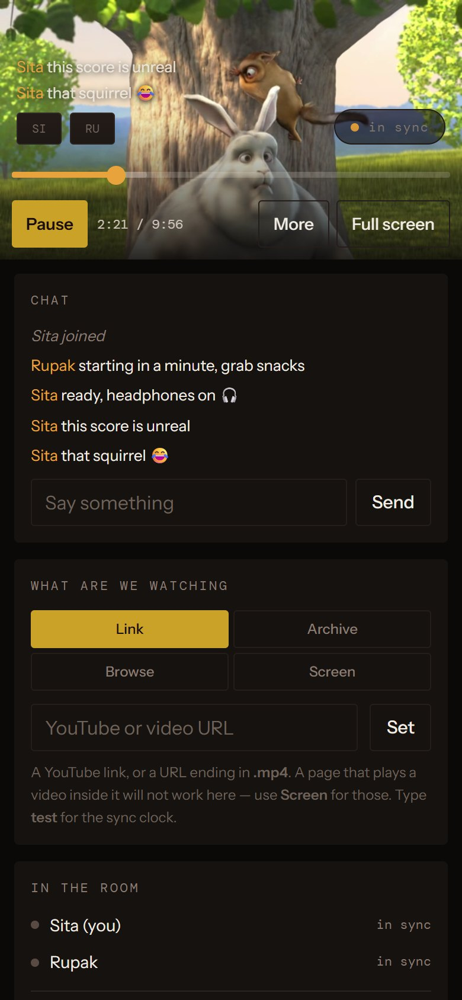
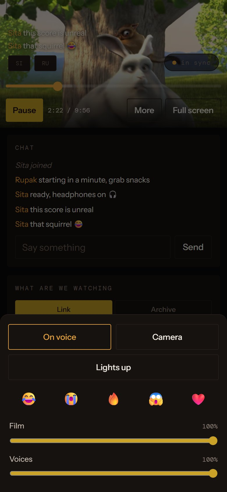
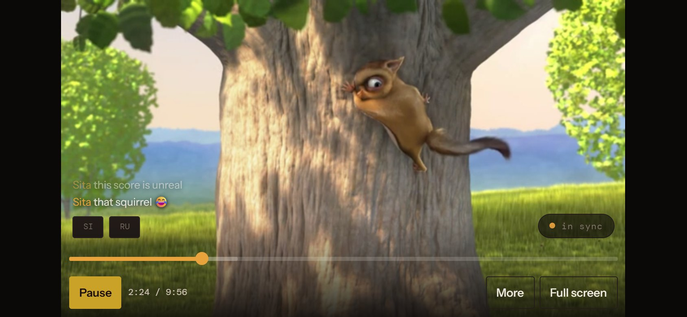

# Watch Together

**Watch the same film at the same moment with friends in other places — and talk the whole way through.**

Open a room, pick something to watch, share a six-character code. Every playhead in the room is held to one
clock within about a tenth of a second, with voice, camera, chat and reactions on the same screen. It runs
free on Cloudflare's edge, needs no account, and works on desktop and on phones.



---

## Contents

- [Screenshots](#screenshots)
- [What it does](#what-it-does)
- [Quick start](#quick-start)
- [Getting a film into the room](#getting-a-film-into-the-room)
- [On phones](#on-phones)
- [Deploying](#deploying)
- [Voice, camera and TURN](#voice-camera-and-turn)
- [How the sync works](#how-the-sync-works)
- [Project layout](#project-layout)
- [API and room protocol](#api-and-room-protocol)
- [Things that will bite whoever touches this next](#things-that-will-bite-whoever-touches-this-next)
- [Known limits](#known-limits)
- [Repository rules](#repository-rules)

---

## Screenshots

### Desktop

| Home | Room — lights up |
|---|---|
|  |  |
| Start a room or join one with a code. Nothing to install, no sign-up. | The foyer. Pick a source, see who is in the room and on voice, chat while people arrive. |

| Room — lights down | Embedded browser |
|---|---|
|  |  |
| The house. The film takes the screen; chat rises over the picture and fades, faces sit in a rail. | A browser inside the room, shown to everyone as a screen share. A video file it finds goes to the room with **Play in room** and plays in sync. |

### Phone

| Upright, playing | More sheet | On its side |
|---|---|---|
|  |  |  |
| Picture on top, one-row controls, chat right underneath while the film plays. | Voice, camera, reactions, volume and Lights fold into a sheet behind **More**. | The picture fills the height; the page scrolls to chat and the rest. |

*Captured from two real clients in one room. The film is* Big Buck Bunny *© Blender Foundation,
[CC BY 3.0](https://creativecommons.org/licenses/by/3.0/), streamed from the Internet Archive.*

---

## What it does

**Rooms** — `/r/CODE`. Codes are six characters from an alphabet with no `0 1 I L O`, so they survive
being read aloud. The first person in is the host and can lock play, pause and seek to themselves; if the
host leaves, the room passes to whoever is still there.

**Two temperatures** — the room has a *foyer* (lights up: plum and brass, the sidebar, the title row) and a
*house* (lights down: warm black, the film edge to edge). Starting playback dims the lights over 900ms;
pausing brings them back up faster, because a pause is an interruption and people need to see each other.

**Sources**

| Source | How it syncs |
|---|---|
| **YouTube** link | Player API, discrete rates — wider deadband, micro-seeks |
| **Direct video URL** (`.mp4`) | `<video>`, fine playback-rate correction |
| **Internet Archive** search | Picks a browser-playable file; takes part 1 when a film is split into reels |
| **Screen share** | Live stream — already the same moment for everyone, so sync stands down |
| **Embedded browser** | Shown to the room as a screen share; a video file it finds can be sent as a direct link instead |
| `test` | A synthetic clock with no media, for measuring the sync engine itself |

**Playback** — seek bar with hover preview and arrow-key nudges, subtitles found automatically beside the
film (`movie.vtt` or `movie.srt` next to `movie.mp4`), full screen, separate film and voice volume, and a
per-device ±300ms nudge for matching a second screen in the same room.

**Talking** — peer-to-peer voice and optional camera over the room's own WebSocket, push-to-talk on **T**,
mute that shows in the roster, speaking detection that lights up the speaker's tile, and ducking that dips
the film to 25% while someone talks. Chat keeps the last 50 messages for late joiners; reactions float over
the picture and vanish.

**Protective defaults** — a camera during playback is capped at 180p/150 kbps and pauses incoming video
entirely when the film's buffer runs low, because WebRTC wins any bandwidth fight against a video fetch and
an uncapped camera would stall the film.

---

## Quick start

Needs Node 20+.

```bash
npm install
npm run dev
```

Open `http://localhost:8787`, press **Start a room**, and open the `/r/CODE` link in a second tab or on
another device. Type `test` into the **Link** box for the sync clock, or search the **Archive** tab for a
public-domain film.

---

## Getting a film into the room

**YouTube, or a direct link.** Paste it into **Link** and press **Set**. A direct link has to *be* the video
file — a URL ending in `.mp4`. A web page that plays a video inside it is not a video file and will not load
there; use screen share for those.

**A film on your own computer.** Serve the folder over a public HTTPS link — nothing is uploaded, and there
is no storage limit:

```bash
npm run share -- "C:\Users\you\Videos\movies"
```

It lists every `.mp4`, `.m4v`, `.webm`, `.mov` and `.ogv` in the folder with a link to paste into **Link**,
serves byte ranges so seeking works, and serves any `.vtt` or `.srt` beside a film so its subtitles load too.
Keep the window open for the whole film. It needs
[`cloudflared`](https://developers.cloudflare.com/cloudflare-one/connections/connect-networks/downloads/)
(`winget install --id Cloudflare.cloudflared`), and every viewer streams from your upload — a 1080p film
needs roughly 5 Mbps of upstream per viewer.

**Converting an MKV.** Browsers do not play Matroska, and no browser decodes AC3, E-AC3 or DTS audio. Check
the video codec first, because it decides whether this takes a minute or an hour:

```bash
ffprobe -v error -select_streams v:0 -show_entries stream=codec_name -of csv=p=0 "film.mkv"
```

If it says `h264`, copy the video and convert only the audio — minutes:

```bash
ffmpeg -i "film.mkv" -map 0:v:0 -map 0:a:0 -c:v copy -c:a aac -b:a 192k -ac 2 -sn -movflags +faststart "movie.mp4"
```

If it says `hevc`, the video has to be re-encoded — most of an hour:

```bash
ffmpeg -i "film.mkv" -map 0:v:0 -map 0:a:0 -c:v libx264 -crf 20 -preset fast -c:a aac -b:a 192k -ac 2 -movflags +faststart "movie.mp4"
```

`-movflags +faststart` puts the index at the front of the file so playback starts without downloading the
whole thing. Pull subtitles out separately and name them to match — they load on their own:

```bash
ffmpeg -i "film.mkv" -map 0:s:0 "movie.vtt"
```

**Screen share.** From a computer: **Screen** → **Share my screen**, choose **Browser tab**, and tick
**Also share tab audio** or everyone gets a silent film. Quality follows your upload speed.

Bring content you have the right to watch — your own files, YouTube, or the public domain. Rooms are private
and unlisted, and the code is the only way in.

---

## On phones

The room is built for phones as well as desktops, and was checked from 360px wide to 1440px, upright and on
its side.

- **Short screens get a scrolling single column.** The desktop layout fixes its height to the screen, which
  a phone on its side cannot share between a header, a picture and a title row — so below 860px wide *or*
  560px tall, the page scrolls and the picture is sized against the screen alone.
- **Controls stay on one row.** Below a ~900px stage the bar keeps Play, the clock, **More** and Full
  screen; everything else folds into a sheet.
- **Tap the picture** to show or hide the controls, as in any phone video player.
- **Chat stays under the picture** while the film plays.
- **Full screen on iPhone fills the window.** iPhones only allow fullscreen on a bare `<video>`, which would
  leave the controls, chat and faces behind, so the stage covers the window instead. Everywhere else it is
  real fullscreen, and Android turns an upright phone landscape.
- **Screen sharing is desktop only.** No phone browser exposes `getDisplayMedia`; phones can still watch a
  screen shared from a computer, and the button says so.
- **Notch and home indicator** are respected (`viewport-fit=cover` with safe-area insets), text fields are
  16px on touch screens so iOS does not zoom into them, and hover styles only apply where there is a pointer
  that can hover.

---

## Deploying

```bash
npx wrangler login
npx wrangler deploy
```

The first deploy asks for a `workers.dev` subdomain. The site then lives at
`https://watch-together.<subdomain>.workers.dev` — the worker name comes first; the bare
`<subdomain>.workers.dev` serves nothing. A new subdomain can take a few minutes to get DNS and a
certificate.

Everything runs on the free plan: one Durable Object per room (SQLite-backed, which is the only kind the free
plan has), static assets, and a small Worker for the API.

---

## Voice, camera and TURN

Voice is a full peer-to-peer mesh over the room's WebSocket — no second service, no media server. Public STUN
connects most people directly; roughly one in six sits behind a symmetric NAT and needs a relay. To turn one
on, create a Realtime TURN key in the Cloudflare dashboard and set:

```bash
npx wrangler secret put TURN_TOKEN_ID
npx wrangler secret put TURN_API_TOKEN
```

`/api/ice` picks them up with no client change, and falls back to STUN if they are missing or the call fails,
so a relay outage never takes voice down for people who do not need one. Cloudflare's free tier covers
1,000 GB of relayed traffic a month.

Mesh stops scaling above about four people — every extra person costs everyone another upstream. Beyond that
an SFU is needed, on the same account.

---

## How the sync works

Every client streams the film **independently**. The room broadcasts only a clock:

```
      video host (CDN, YouTube, your machine)
       /          |          \
   Rupak        Sita        Aarav        each plays its own copy
       \          |          /
     Durable Object — one per room       { playing, anchorTime, anchorClock }
```

The room never sends a bare position. It sends an **anchor** — a movie time — and the wall clock that anchor
was true at, so any client computes its own target, including one that joined between messages:

```
target = anchorTime + (syncedNow() - anchorClock) / 1000
```

`syncedNow()` comes from NTP-style offset estimation against the room, keeping the **lowest round-trip**
sample of the last eight rather than the average — a sample delayed by a congested hop carries that delay
straight into its estimate.

**Correction is by playback rate, not seeking.**

```
|drift| < 50ms       hold
|drift| < 1s         playbackRate = 1 ± up to 7%    (past ~10% the pitch shift is audible)
|drift| ≥ 1s         seek to target + 150ms
```

**Nobody holds the room hostage.** Play and seek run a ready-check: each client seeks, buffers, and reports
ready; the room waits for everyone or 8 seconds, then starts all clients on the same future timestamp. Anyone
still loading is pulled in by drift correction.

### Measured

| | Result |
|---|---|
| Drift between two clients | **4 ms** |
| Recovery from a 600ms knock | ~70 ms/s, back inside ±150ms in 7s, without seeking |
| Recovery from a 2.4s knock | seeks, lands at +150ms, nudges in |
| Two machines, different networks | voice on STUN alone, screen share reaches viewers, playback in sync |

---

## Project layout

```
src/
  index.js          Worker — routing, room codes, /r/ pages, Archive proxy, ICE, embed check
  room.js           Durable Object — clock, ready-check, host and permissions, roster, chat, signalling
public/
  index.html        Home page             home.css  home.js
  room.html         The room              room.css  room.js
  style.css         Tokens and base — the two grounds, touch and hover rules
  sync.js           SyncClock and DriftCorrector
  adapters.js       Video sources behind one interface
  voice.js          Peer-to-peer voice, camera and screen share
  browser.js        The embedded browser
  tick-worker.js    Worker-thread timer, so a background tab keeps correcting
scripts/
  share-local.mjs   Serve a folder of films over a Cloudflare quick tunnel, with Range support
docs/screenshots/   The images in this README
.githooks/          Single-author and no-attribution commit checks
wrangler.jsonc      Worker, assets and Durable Object configuration
```

### Adding a source

Implement the interface in `adapters.js` and register it in `createSource`. Nothing in `sync.js` should need to
change:

```
play() pause() seek(t) getCurrentTime() getBufferedAhead()
setPlaybackRate(r) setVolume(v) isReady() destroy()
supportsFineRate: boolean      isLive?: boolean
```

`supportsFineRate: false` widens the deadband to ±400ms and switches to micro-seeks. `isLive: true` makes the
sync engine stand down entirely.

---

## API and room protocol

**HTTP**

| Route | Purpose |
|---|---|
| `GET /api/new-room` | A fresh room code |
| `GET /api/ice` | ICE servers — STUN, plus TURN when credentials are set |
| `GET /api/archive/search?q=` | Internet Archive film search, proxied |
| `GET /api/archive/pick?id=` | A browser-playable file from an Archive item |
| `GET /api/embed-check?url=` | Whether a page can be framed, plus its title, video files and links |
| `GET /ws?room=CODE` | WebSocket into the room's Durable Object |
| `GET /r/CODE` | The room page |

**WebSocket messages** handled by the room: `hello` `ping` `status` · `source` `play` `pause` `seek` `ready`
`settings` · `chat` `react` · `presence` `signal` · `browse`. The room sends back `pong`, `you`, `state`,
`prepare`, `playat`, `roster`, `history`, `chat`, `react`, `system`, `signal`, `browse` and `denied`.

---

## Things that will bite whoever touches this next

- **`new_sqlite_classes`, not `new_classes`**, in `wrangler.jsonc`. SQLite-backed Durable Objects are the only
  kind on the free plan; the other spelling works locally and fails on deploy.
- **The ready-check timeout is a storage alarm**, not `setTimeout`. A hibernating Durable Object has no live
  timers.
- **`/r/CODE` requests `/room`, not `/room.html`.** The asset handler 301s `.html` to the extensionless path,
  and following that redirect wipes the room code out of the address bar.
- **`[hidden] { display: none !important }` is load-bearing.** Author rules beat the UA stylesheet, so a plain
  `label { display: block }` silently defeats `hidden`.
- **A fixed box obeys `align-self` and `justify-self` now.** The stage is centred in its grid cell, and in
  window-filling full screen that shrank it to fit its absolutely positioned contents — 0×0. It stretches
  explicitly there.
- **The controls bar is measured, not assumed.** Faces, floating chat, the sync pill and subtitle cues clear
  `--ctrl-h`, which a `ResizeObserver` keeps equal to the bar's visible height.
- **iOS zooms into any field under 16px and stays zoomed.** Touch screens get 16px text in every field.
- **iOS keeps `:hover` after a tap.** Hover rules live behind `@media (hover: hover)`.
- **Archive items are often reels, not films.** Many hold only `...-3of5.mp4`; the picker takes part 1 and
  reports the count rather than landing on an arbitrary middle reel.
- **A blocked iframe raises no error.** A frame refused by `X-Frame-Options` or CSP is a blank rectangle with
  no event and no readable location — which is why `/api/embed-check` exists, and why the embedded browser's
  address bar tracks only what was opened through it.
- **`HTML_SCAN_BYTES` is 1.6 MB on purpose.** YouTube puts its `<title>` 700 KB into the response.
- **Room codes exclude `0 1 I L O`.** A code like `PLAY22` or `FULL22` is invalid and redirects home.

---

## Known limits

- **Checked in phone emulation, not yet on a physical iPhone.** Emulation reports zero safe-area insets and
  does not reproduce iOS focus-zoom or Safari's toolbars, so those need a real device.
- **Taps over a YouTube player** do not reach the room, so on a phone they cannot bring up the controls. A
  tap-catching layer would also block YouTube's own play prompt, which iOS can require.
- **Mesh voice** is untested above two people and will not scale past about four without an SFU.
- **HLS** (`.m3u8`) is not wired up yet; unlike a plain MP4 it needs CORS on the origin.
- **No uploads.** Serving from your own machine with `npm run share` replaced them.

Planning notes: [FINAL-PLAN.md](FINAL-PLAN.md) · [RISKS.md](RISKS.md) · [PLAN.md](PLAN.md)

---

## Repository rules

Every commit in this repository is authored by **Rupak Pandey** alone, with no attribution trailers. That is
enforced by the hooks in `.githooks/`; turn them on once in a fresh clone:

```bash
git config core.hooksPath .githooks
```

See [CLAUDE.md](CLAUDE.md) for the full rules.
